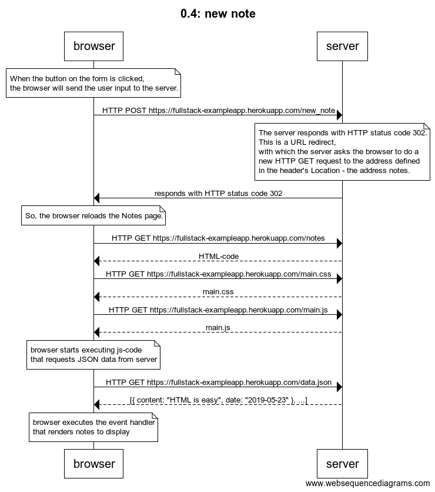
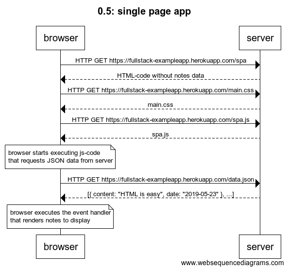
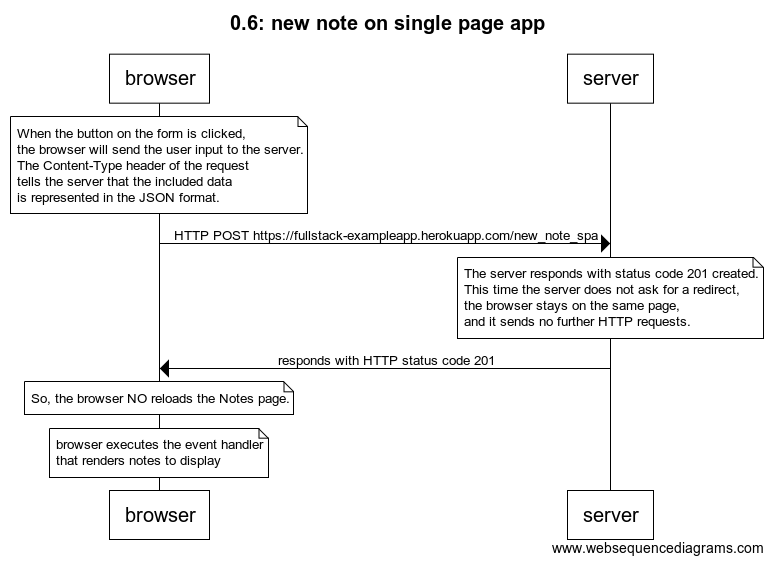

# [Fundamentals of Web apps](https://fullstackopen.com/en/part0/fundamentals_of_web_apps)

## 0.1: HTML

Review the basics of HTML by reading this tutorial from Mozilla: [HTML tutorial](https://developer.mozilla.org/en-US/docs/Learn/Getting_started_with_the_web/HTML_basics)

## 0.2: CSS

Review the basics of CSS by reading this tutorial from Mozilla: [CSS tutorial](https://developer.mozilla.org/en-US/docs/Learn/Getting_started_with_the_web/CSS_basics)

## 0.3: HTML forms

Learn about the basics of HTML forms by reading Mozilla's tutorial: [Your first form](https://developer.mozilla.org/en-US/docs/Learn/Forms/Your_first_form)

## 0.4: new note

Create a diagram depicting the situation where the user creates a new note on page https://fullstack-exampleapp.herokuapp.com/notes by writing something into the text field and clicking the submit button.

### Solution



By https://www.websequencediagrams.com/

```
title 0.4: new notev

note over browser:
When the button on the form is clicked,
the browser will send the user input to the server.
end note
browser->server: HTTP POST https://fullstack-exampleapp.herokuapp.com/new_note
note over server:
The server responds with HTTP status code 302.
This is a URL redirect,
with which the server asks the browser to do a
new HTTP GET request to the address defined
in the header's Location - the address notes.
end note
server->browser: responds with HTTP status code 302
note over browser:
So, the browser reloads the Notes page.
end note
browser->server: HTTP GET https://fullstack-exampleapp.herokuapp.com/notes
server-->browser: HTML-code
browser->server: HTTP GET https://fullstack-exampleapp.herokuapp.com/main.css
server-->browser: main.css
browser->server: HTTP GET https://fullstack-exampleapp.herokuapp.com/main.js
server-->browser: main.js

note over browser:
browser starts executing js-code
that requests JSON data from server
end note

browser->server: HTTP GET https://fullstack-exampleapp.herokuapp.com/data.json
server-->browser: [{ content: "HTML is easy", date: "2019-05-23" }, ...]

note over browser:
browser executes the event handler
that renders notes to display
end note
```

## 0.5: Single page app

Create a diagram depicting the situation where the user goes to the single page app version of the notes app at https://fullstack-exampleapp.herokuapp.com/spa.

### Solution



```
title 0.5: single page app

browser->server: HTTP GET https://fullstack-exampleapp.herokuapp.com/spa
server-->browser: HTML-code without notes data
browser->server: HTTP GET https://fullstack-exampleapp.herokuapp.com/main.css
server-->browser: main.css
browser->server: HTTP GET https://fullstack-exampleapp.herokuapp.com/spa.js
server-->browser: spa.js

note over browser:
browser starts executing js-code
that requests JSON data from server
end note

browser->server: HTTP GET https://fullstack-exampleapp.herokuapp.com/data.json
server-->browser: [{ content: "HTML is easy", date: "2019-05-23" }, ...]

note over browser:
browser executes the event handler
that renders notes to display
end note
```

## 0.6: New note on Single page app

Create a diagram depicting the situation where user creates a new note using the single page version of the app.

### Solution



```
title 0.6: new note on single page app

note over browser:
When the button on the form is clicked,
the browser will send the user input to the server.
The Content-Type header of the request
tells the server that the included data
is represented in the JSON format.
end note
browser->server: HTTP POST https://fullstack-exampleapp.herokuapp.com/new_note_spa
note over server:
The server responds with status code 201 created.
This time the server does not ask for a redirect,
the browser stays on the same page,
and it sends no further HTTP requests.
end note
server->browser: responds with HTTP status code 201
note over browser:
So, the browser NO reloads the Notes page.
end note
note over browser:
browser executes the event handler
that renders notes to display
end note
```
